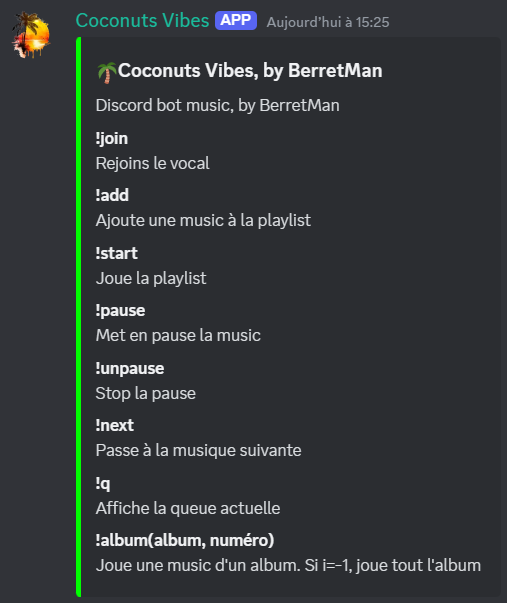

# 🌴 **Coconuts Vibes** 
  

🌴 **Coconuts Vibes**  is a Discord music bot than supports album playing and youtube downloads.
> **Note**: Music downloaded from YouTube is stored in the `None` folder.

---
## 🚀 **Features**  
- 📀 Play entire albums directly via Discord bot.  
- 🎵 Download music directly from YouTube.  
- 📂 Manage your music collection with a simple database system.  
##  📝 **Commands list**

  

---

## 🛠️ **Installation**
- Clone the repo
- Add personal discord Token in TOKEN.TXT
Make sure you have Python, `discord.py`, `pytube` installed.
You also need **ffmpeg** 
### 🪟**On Windows**:
```powershell
    choco install ffmpeg
```
### 🐧**On Linux** 
```bash
    sudo apt install ffmpeg
```
